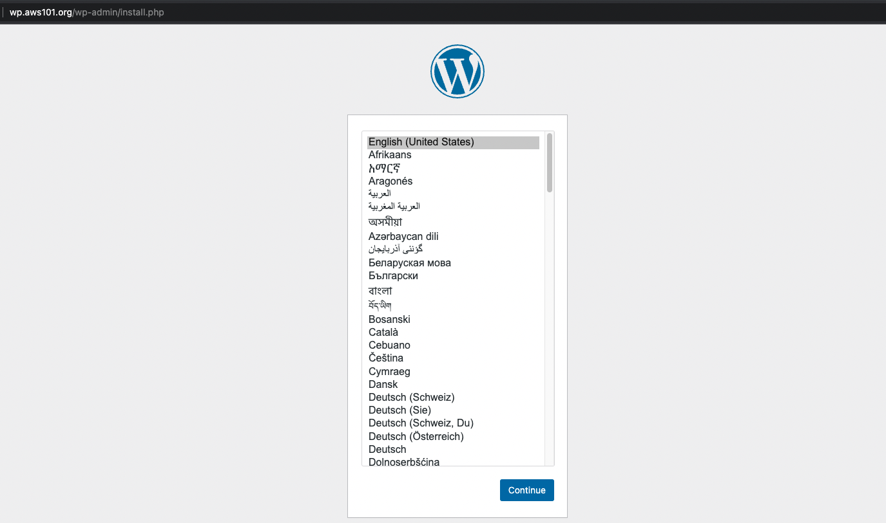

# AWS UG Containers Day Argentina 2022

[](https://github.com/AWS101/containers-day-arg/actions/workflows/main.yml)

## Dependencias

- [AWS CLI v2](https://docs.aws.amazon.com/es_es/cli/latest/userguide/getting-started-install.html)
- [EKSCTL](https://eksctl.io/introduction/#installation)
- [KubeCtl](https://kubernetes.io/docs/tasks/tools/)
- [Docker]()


## Preparacion

- Creamos el Cluster de EKS

    ```bash
    eksctl create cluster -f awsug-containers-day-2022.yaml
    ```

    ```bash
    2022-11-13 13:40:58 [ℹ]  eksctl version 0.118.0
    2022-11-13 13:40:58 [ℹ]  using region us-east-1
    2022-11-13 13:41:00 [ℹ]  subnets for us-east-1c - public:192.168.0.0/19 private:192.168.64.0/19
    2022-11-13 13:41:00 [ℹ]  subnets for us-east-1d - public:192.168.32.0/19 private:192.168.96.0/19
    2022-11-13 13:41:00 [ℹ]  nodegroup "ng-219df3a7" will use "" [AmazonLinux2/1.23]
    2022-11-13 13:41:00 [ℹ]  using Kubernetes version 1.23
    2022-11-13 13:41:00 [ℹ]  creating EKS cluster "aws101" in "us-east-1" region with managed nodes
    2022-11-13 13:41:00 [ℹ]  1 nodegroup (ng-219df3a7) was included (based on the include/exclude rules)
    2022-11-13 13:41:00 [ℹ]  will create a CloudFormation stack for cluster itself and 0 nodegroup stack(s)
    2022-11-13 13:41:00 [ℹ]  will create a CloudFormation stack for cluster itself and 1 managed nodegroup stack(s)
    2022-11-13 13:41:00 [ℹ]  if you encounter any issues, check CloudFormation console or try 'eksctl utils describe-stacks --region=us-east-1 --cluster=aws101'
    ```

- Verificamos cluster

    Verificamos que el cluster se encuentre arriba y que sus nodos esten ready

    ```shell
    kubectl cluster-info
    ```

    ```shell
    Kubernetes control plane is running at https://E166A561EE12E832E7BBB48D45A85137.gr7.us-east-1.eks.amazonaws.com
    CoreDNS is running at https://E166A561EE12E832E7BBB48D45A85137.gr7.us-east-1.eks.amazonaws.com/api/v1/namespaces/kube-system/services/kube-dns:dns/proxy
    ```

    ```shell
    kubectl get nodes
    ```

    ```shell
    NAME                             STATUS   ROLES    AGE   VERSION
    ip-192-168-20-168.ec2.internal   Ready    <none>   50m   v1.23.9-eks-ba74326
    ip-192-168-36-113.ec2.internal   Ready    <none>   50m   v1.23.9-eks-ba74326
    ```

- Crearemos una IAM Policy y un Role para permitirle al External-DNS interactuar con la API de AWS.
    **Actualizar la zona DNS**

    ```shell
    aws iam create-policy --policy-name externaldns_permissions --policy-document file://iam/iam_policy.json
    ```

    ```json
    {
        "Policy": {
            "PolicyName": "externaldns_permissions",
            "PolicyId": "ANPA2D3CMCQR5WX24NR4A",
            "Arn": "arn:aws:iam::xxxxxxxxxxx:policy/externaldns_permissions",
            "Path": "/",
            "DefaultVersionId": "v1",
            "AttachmentCount": 0,
            "PermissionsBoundaryUsageCount": 0,
            "IsAttachable": true,
            "CreateDate": "2021-09-04T15:58:36+00:00",
            "UpdateDate": "2021-09-04T15:58:36+00:00"
        }
    }
    ```
- Creamos el I.R.S.A. (IAM Role for Service Account)
    - External Dns

        ```shell
        eksctl create iamserviceaccount \
            --name external-dns \
            --cluster aws101 \
            --attach-policy-arn arn:aws:iam::695454143523:policy/externaldns_permissions \
            --approve \
            --override-existing-serviceaccounts
        ```
    - extraemos el role ARN para External DNS

        ```shell
        eksctl get iamserviceaccount \
        --cluster aws101 \
        -o json | jq \
        -r '.[] | select(.metadata.name=="external-dns").status.roleARN'
        ```

    - (Habilitamos EBS CSI controller)[https://docs.aws.amazon.com/eks/latest/userguide/ebs-csi.html]

    ```shell
    eksctl create iamserviceaccount \
        --name ebs-csi-controller-sa \
        --namespace kube-system \
        --cluster aws101 \
        --attach-policy-arn arn:aws:iam::aws:policy/service-role/AmazonEBSCSIDriverPolicy \
        --approve \
        --role-only \
        --role-name AmazonEKS_EBS_CSI_DriverRole
    ROLE_ARN=$(eksctl get iamserviceaccount \
    --cluster aws101 \
    -o json | jq \
      -r '.[] | select(.metadata.name=="ebs-csi-controller-sa").status.roleARN')
    eksctl create addon --name aws-ebs-csi-driver --cluster aws101 --service-account-role-arn ${ROLE_ARN} --force
    ```

- Instalamos el ingress controller Nginx

    ```shell
    kubectl apply -f https://raw.githubusercontent.com/kubernetes/ingress-nginx/controller-v1.0.0/deploy/static/provider/aws/deploy.yaml
    ```

    ```shell
        namespace/ingress-nginx created
        serviceaccount/ingress-nginx created
        configmap/ingress-nginx-controller created
        clusterrole.rbac.authorization.k8s.io/ingress-nginx created
        clusterrolebinding.rbac.authorization.k8s.io/ingress-nginx created
        role.rbac.authorization.k8s.io/ingress-nginx created
        rolebinding.rbac.authorization.k8s.io/ingress-nginx created
        service/ingress-nginx-controller-admission created
        service/ingress-nginx-controller created
        deployment.apps/ingress-nginx-controller created
        ingressclass.networking.k8s.io/nginx created
        validatingwebhookconfiguration.admissionregistration.k8s.io/ingress-nginx-admission created
        serviceaccount/ingress-nginx-admission created
        clusterrole.rbac.authorization.k8s.io/ingress-nginx-admission created
        clusterrolebinding.rbac.authorization.k8s.io/ingress-nginx-admission created
        role.rbac.authorization.k8s.io/ingress-nginx-admission created
        rolebinding.rbac.authorization.k8s.io/ingress-nginx-admission created
        job.batch/ingress-nginx-admission-create created
        job.batch/ingress-nginx-admission-patch created
    ```


## Desplegamos nuestra aplicacion

En este workshop vamos a utilizar como ejemplo una aplicacion statefull compuesta por un servicio de bases de datos basado en MariaDB, un servicio web basado en Apache corriendo un Wordpress y External DNS para gestionar automaticamente los registros DNS.
El objetivo es meramente educativo y pretende demostrar como desplegar containers statefull con almacenamiento basado en EBS.

1. deplegamos los manifiestos de Kubernetes utilizando Kubectl

```shell
kubectl apply -f manifests
```

```shell
persistentvolumeclaim/mariadb-data-disk created
persistentvolumeclaim/wp-pv-claim created
secret/mariadb-secrets created
deployment.apps/mariadb created
service/mariadb created
deployment.apps/wordpress created
service/wordpress created
ingress.networking.k8s.io/wp created
serviceaccount/external-dns created
clusterrole.rbac.authorization.k8s.io/external-dns created
clusterrolebinding.rbac.authorization.k8s.io/external-dns created
deployment.apps/external-dns created
```

2. Verificamos que los deployments se encuentren en Available

```shell
kubectl get deployments
```

```shell
NAME           READY   UP-TO-DATE   AVAILABLE   AGE
external-dns   1/1     1            1           70s
mariadb        1/1     1            1           73s
wordpress      1/1     1            1           73s
```

3. Verificamos que los pods se encuentren corriendo

```shell
kubectl get pods
```

```shell
NAME                            READY   STATUS    RESTARTS   AGE
external-dns-65f6b4cc8b-6p846   1/1     Running   0          2m48s
mariadb-d66f64f79-lkmqz         1/1     Running   0          2m51s
wordpress-76b458d445-7lk27      1/1     Running   0          2m51s
```

4. Verificamos que External-DNS haya creado los registros DNS para nuestra aplicacion

```shell
kubectl logs external-dns-65f6b4cc8b-6p846
```

```shell
time="2022-11-14T12:22:18Z" level=info msg="Desired change: CREATE wp.aws101.org TXT [Id: /hostedzone/Z09150013CKR0A2R2DQQQ]"
time="2022-11-14T12:22:18Z" level=info msg="3 record(s) in zone aws101.org. [Id: /hostedzone/Z09150013CKR0A2R2DQQQ] were successfully updated"
time="2022-11-14T12:23:18Z" level=info msg="Applying provider record filter for domains: [aws101.org. .aws101.org.]"
time="2022-11-14T12:23:18Z" level=info msg="All records are already up to date"
time="2022-11-14T12:24:19Z" level=info msg="Applying provider record filter for domains: [aws101.org. .aws101.org.]"
time="2022-11-14T12:24:19Z" level=info msg="All records are already up to date"
```

5. probamos nuestra aplicacion ingresando a

[wp.aws101.org](http://wp.aws101.org/)



## Removemos los recursos

### Removemos los recursos en Kubernetes
Es importante no saltearse este paso ya que algunos recursos en kubernetes generan recursos en AWS, si se saltean este paso pueden correr el riesgo de dejar algun recurso de AWS en el camino que les pueda genera costos a futuro.

```shell
kubectl delete -f manifests
```

```shell
persistentvolumeclaim "mariadb-data-disk" deleted
persistentvolumeclaim "wp-pv-claim" deleted
secret "mariadb-secrets" deleted
deployment.apps "mariadb" deleted
service "mariadb" deleted
deployment.apps "wordpress" deleted
service "wordpress" deleted
ingress.networking.k8s.io "wp" deleted
serviceaccount "external-dns" deleted
clusterrole.rbac.authorization.k8s.io "external-dns" deleted
clusterrolebinding.rbac.authorization.k8s.io "external-dns" deleted
deployment.apps "external-dns" deleted
```

### Removemos el cluster

```shell
  eksctl delete cluster -f awsug-containers-day-2022.yaml
```

### Removemos la policy generada

```shell
aws iam delete-policy --policy-arn arn:aws:iam::695454143523:policy/aws101_externaldns_permissions
```

## Disclaimer

Para realizar las prácticas no es necesario utilizar un cloud provider, la mayoria de las practicas se pueden realizar en [Play With K8s](https://labs.play-with-k8s.com/), de todas maneras para algunas prácticas relacionadas con componentes que solo están disponibles en un cloud provider es preferible que sea en un cloud provider como AWS, GCP o Azure.
El participante es 100% responsable de los costos generados al realizar las prácticas, desde este espacio renunciamos a toda responsabilidad por costos generados al realizar los laboratorios.
Les pedimos que sean conscientes de remover todos los recursos utilizados cuando finalicen las prácticas.

## Autor

Damian A. Gitto Olguin

[AWS Community Hero](https://www.youtube.com/c/damianolguinAWSHERO)

[@enlink](https://twitter.com/enlink)] / [@teracloudio](https://twitter.com/teracloudio)
<https://teracloud.io>
